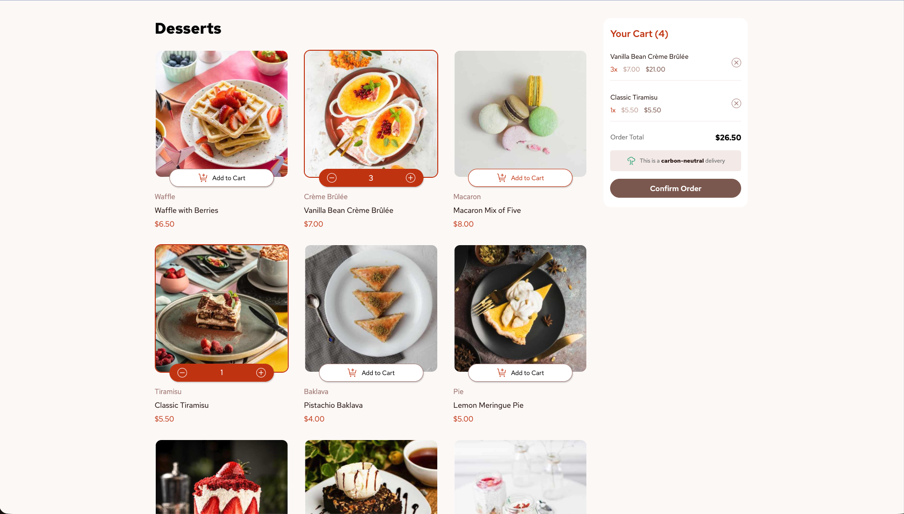
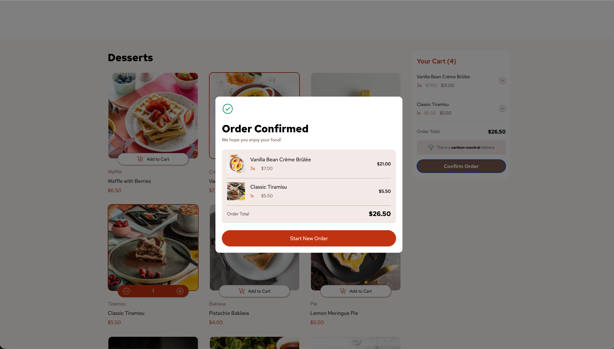
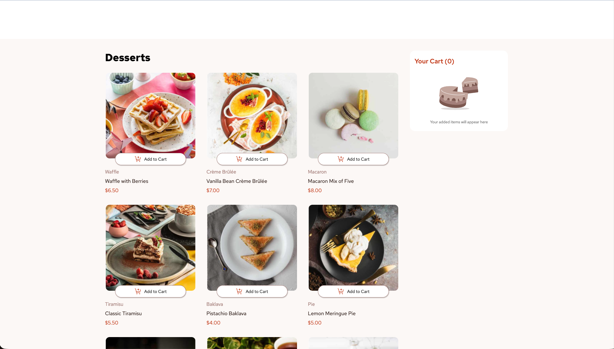
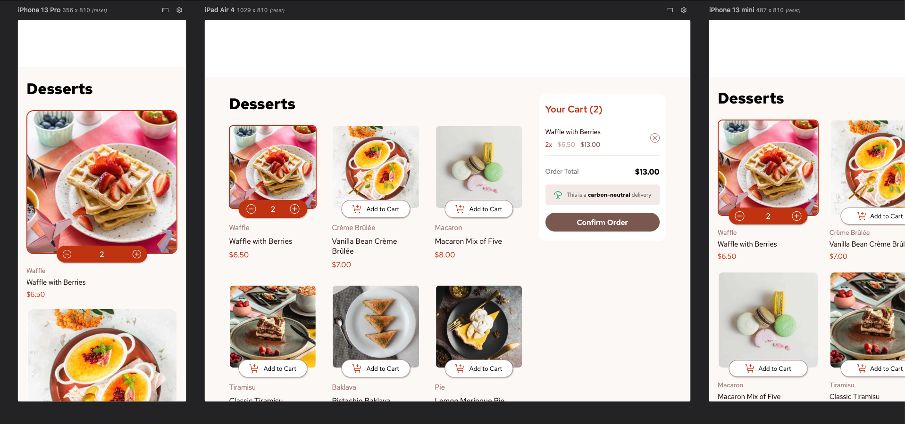

# Frontend Mentor - Product list with cart solution

This is a solution to the [Product list with cart challenge on Frontend Mentor](https://www.frontendmentor.io/challenges/product-list-with-cart-5MmqLVAp_d). Frontend Mentor challenges help you improve your coding skills by building realistic projects. 

## Table of contents

- [Overview](#overview)
  - [The challenge](#the-challenge)
  - [Screenshot](#screenshot)
  - [Links](#links)
- [My process](#my-process)
  - [Built with](#built-with)
  - [What I learned](#what-i-learned)
- [Author](#author)

## Overview

### The challenge

Users should be able to:

- Add items to the cart and remove them
- Increase/decrease the number of items in the cart
- See an order confirmation modal when they click "Confirm Order"
- Reset their selections when they click "Start New Order"
- View the optimal layout for the interface depending on their device's screen size
- See hover and focus states for all interactive elements on the page

### Screenshot

### Links

- Solution URL: [Add solution URL here](https://github.com/Artem12122/Desserts)

## My process

### Built with

- Semantic HTML5 markup
- CSS custom properties (Variables)
- Flexbox
- CSS Grid
- Vanilla JavaScript (No frameworks/libraries)
- Functional Programming patterns (Array methods)
- Desktop-first workflow

### What I learned

This project was a great exercise in managing "State" and keeping the UI in sync with data. Here are the key technical takeaways:

1. **Centralized UI Updates:** Instead of manually changing each element, I created an `updateUI()` function that re-renders the cards and the basket whenever the data changes.
2. **Data Manipulation:** I used `reduce` to calculate totals and item counts efficiently.
3. **Event Delegation:** I implemented a single event listener on parent containers (`container` and `containerBasket`) to handle clicks on dynamically generated buttons using `.closest()`.

## Author

- Website - [Artem Lavrenko]
- Frontend Mentor - [@Artem12122](https://www.frontendmentor.io/profile/Artem12122)